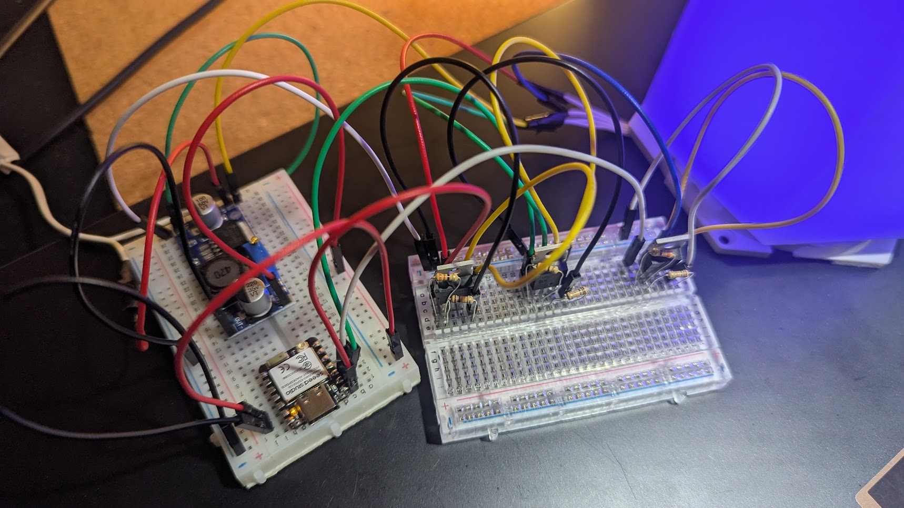

# HuePelarboj - Hue-Compatible IKEA Lamp

Convert your IKEA PELARBOJ lamp into a Philips Hue compatible smart light using ESP32-C6 and Zigbee.

## Acknowledgments

This project is inspired by and builds upon the excellent work by [n0rt0nthec4t](https://github.com/n0rt0nthec4t) and their [HomeSpan-IKEA-PELARBOJ](https://github.com/n0rt0nthec4t/HomeSpan-IKEA-PELARBOJ) project. Special thanks for the original concept, hardware design, and schematic that made this Hue-compatible version possible.

## Overview

This project transforms an IKEA PELARBOJ lamp into a smart RGB light that can be controlled through Philips Hue bridges and apps. Unlike the original HomeKit implementation, this version uses Zigbee protocol for seamless integration with existing Hue ecosystems.